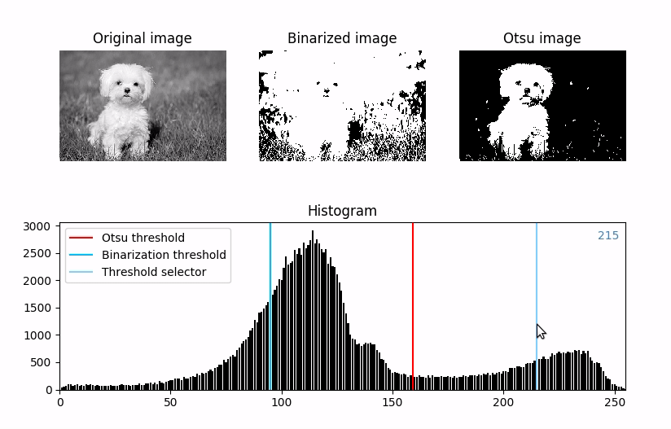

# Histogram creator. Image binarizator

Using picked histogram threshold and Otsu algorithm

## Example of use



## Installation

```bash
pipenv install
```

## Launch

from current directory:

```bash
pipenv shell
python main.py image_path
```
